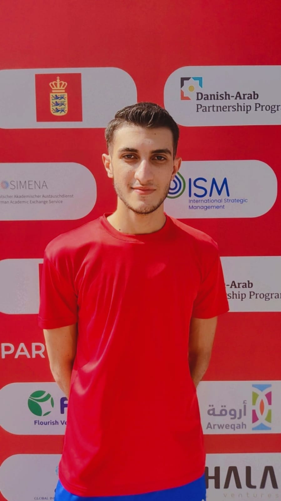

# 🚀 Abdelrhman Islam | Portfolio Website

Welcome to my personal **Portfolio Website**!  
This project showcases my background, skills, certificates, books I’ve read, hobbies, and professional journey as a **developer**, **content creator**, and **cybersecurity enthusiast**.



---

## 🌐 Live Demo

Visit the live version of my website here:  
👉 [https://abdelrhmanislam.github.io/my_portfolio/](https://abdelrhmanislam.github.io/my_portfolio/)

---

## 📁 Sections Included

- 🏠 **Home**: Welcome section with dynamic typing animation and social media links.
- 👨‍💻 **About**: My background and current focus in computer science and tech.
- 🧠 **Skills**: A wide range of technical and soft skills.
- 📚 **Books**: Some of the best books I’ve read on cybersecurity and hacking.  
  [Check the full Cyber Books Repo ➡️](https://github.com/AbdelrhmanIslam/cyber_books)
- 🏅 **Certificates**: All my certifications in one place.  
  [See them on Google Drive ➡️](https://drive.google.com/drive/folders/1oLRubxXwuFTOrw9JsEYpgI075r_eKdnz?usp=sharing)
- 🧑‍🍳 **Hobbies**: Things I love doing in my free time.
- 📬 **Contact Form**: Reach out to me easily via a simple form.

---

## 🎯 Features

- 💡 Dark/Light Mode toggle 🌙🌞
- 🔄 Smooth scroll & active nav highlight
- 💬 Typing animation for job titles
- 📚 Book gallery with hover zoom
- 🎖️ Stylish cards for skills, hobbies, and certificates
- ✨ AOS (Animate On Scroll) transitions
- 📱 Fully responsive design

---

## 🛠️ Built With

- `HTML5`, `CSS3`, and `JavaScript`
- `FontAwesome` for icons
- `Google Fonts` (`Poppins`)
- `AOS.js` for scroll animations
- Responsive layout with pure CSS
- Hosted on **GitHub Pages**

---

## 👨‍🎓 About Me

I am **Abdelrhman Islam**, a student at the Faculty of Computer Science passionate about:
- 🧑‍💻 Full-stack development
- 🔐 Cybersecurity
- 🎨 UI/UX design
- 📈 Data analysis
- 📚 Lifelong learning

I’m also a **content creator**, reader, and space science explorer 🚀  
Languages: Arabic (native), English (intermediate), German (basic)

---

## 📫 Contact Me

- GitHub: [@AbdelrhmanIslam](https://github.com/AbdelrhmanIslam)
- LinkedIn: [abdelrhman-islam-565747317](https://linkedin.com/in/abdelrhman-islam-565747317)
- YouTube: [My Channel](https://www.youtube.com/channel/UCSuSrTeBKb7AZaAhmb4lFsg)
- Email: abdelrhman.islam04@email.com

---

## 📌 How to Run Locally

```bash
git clone https://github.com/AbdelrhmanIslam/my_portfolio.git
cd my_portfolio
open index.html (or just double-click it)
